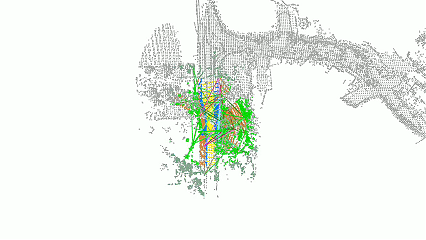
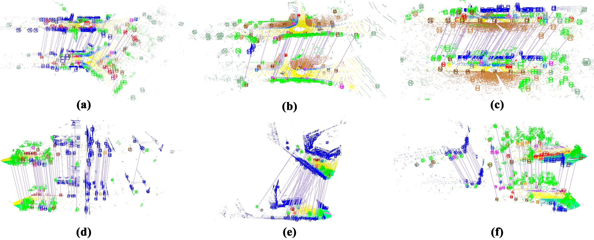

# Semantic-Geometric Graph Descriptor (SGGD)

<p align="center">
  
</p>

<p align="center">
  
</p>

**A Semantic-Geometric Graph Descriptor for Robust LiDAR Place Recognition and Loop Closure Detection**

> Z. Pan, J. Hou and L. Yu, "A Semantic-Geometric Graph Descriptor for Robust LiDAR Place Recognition and Loop Closure Detection," in *IEEE Transactions on Intelligent Transportation Systems*, doi: [10.1109/TITS.2026.3723995](https://doi.org/10.1109/TITS.2026.3723995).  
> Paper: [IEEE Xplore](https://ieeexplore.ieee.org/abstract/document/11670325)

This repository releases the **core SGD algorithm** and the **SemanticKITTI** evaluation / loop-closure tools used in the paper. It is intentionally slim: experiment dumps, ablation outputs, and other datasets are **not** included.

---

## News

- **2026**: Code release for SemanticKITTI place recognition (PR) and loop closure detection.

---

## Features

- Semantic-geometric triangular descriptors built from plane / instance nodes
- Place recognition evaluation with Precision–Recall (PR) curves
- Online-style loop closure detection with pose filtering
- Visualization scripts for loop results and PR curves

---

## Dependencies

- ROS (Catkin), C++17
- PCL, OpenCV, Eigen
- Ceres Solver, GTSAM, yaml-cpp, TBB
- Python 3: `numpy`, `matplotlib`, `pandas` (for plotting scripts)

---

## Build

```bash
# Place this package under a Catkin workspace, e.g. ~/catkin_ws/src/SGD_descriptor
cd ~/catkin_ws
catkin_make -DCMAKE_BUILD_TYPE=Release
source devel/setup.bash
```

Built binaries (under `devel/lib/sgd_desc/`):

| Target | Purpose |
|--------|---------|
| `s_evaluate_matches_triangular` | Pairwise matching → PR metrics (reloc / place recognition) |
| `loop_closure_detection` | Sequential loop closure on a SemanticKITTI sequence |

---

## Dataset layout (SemanticKITTI)

Prepare point clouds (`.bin`), semantic labels (`.label`), and KITTI-format poses (`.txt`):

```text
KITTI_input/
  00/*.bin
  02/*.bin
  ...
KITTI_refer/
  00/*.bin
  02/*.bin
  ...
KITTI_label/
  00/*.label
  02/*.label
  ...
poses/
  00.txt
  02.txt
  ...
```

### Test pairs for PR (no-prior reloc)

We provide a small fixed set of query–database pairs used for test **place recognition / reloc PR without an initial pose**.

- **Download (placeholder):** (https://drive.google.com/file/d/1qAzjRBzhWluM-z8ee-RjWkfEubzn1ELR/view?usp=sharing)

After download, point the evaluation tool to your local folders as shown below.

---

## Configuration

Default parameters: [`config/config_test.yaml`](config/config_test.yaml).

Important keys:

| Parameter | Meaning |
|-----------|---------|
| `voxel_size` | Voxel size for plane / node extraction |
| `descriptor_search_radius` / `descriptor_min_len` / `descriptor_max_len` | Triangle edge constraints |
| `semantic_vertex_match_threshold` | Min. number of semantically matched vertices (0–3; `0` disables semantic check) |
| `semantic_ratio_threshold` | Max. allowed semantic-ratio difference for single-label nodes |
| `plane_node_sequence_similarity_threshold` | Similarity threshold for plane-node label sequences |
| `icp_threshold` / `rough_dis_threshold` | Geometric verification / candidate selection |

Tune outdoors / indoors mainly via `voxel_size` and triangle length limits. See comments inside the YAML for typical ranges.

---

## Usage

### 1) Place recognition / PR evaluation (SemanticKITTI)

Evaluates all query–target pairs within each sequence subfolder, writes PR CSVs and metrics.

```bash
./devel/lib/sgd_desc/s_evaluate_matches_triangular \
  <input_bin_folder> <target_bin_folder> <poses_folder> <labels_folder> \
  <output_folder> config/config_test.yaml [pose_distance_threshold]

# Example (true-match if pose distance < 20 m):
./devel/lib/sgd_desc/s_evaluate_matches_triangular \
  KITTI_input KITTI_input poses KITTI_label \
  results/pr config/config_test.yaml 20.0
```

Outputs per sequence: `{seq}_pr.csv`, `{seq}_detailed.csv`, and `metrics.txt` (AP, SR, timing).

Plot a PR curve:

```bash
python3 plot_pr_curve.py results/pr/00_pr.csv -o results/pr/00_pr.png
```

### 2) Loop closure detection (SemanticKITTI)

```bash
./devel/lib/sgd_desc/loop_closure_detection \
  <bin_folder> <label_folder> <pose_file> <output_folder> config/config_test.yaml \
  [skip_near_frames] [match_threshold] [max_candidate_frames] \
  [pose_distance_threshold] [keyframe_interval] [is_kitti]

# Example (KITTI seq 00):
./devel/lib/sgd_desc/loop_closure_detection \
  KITTI_input/00 KITTI_label/00 poses/00.txt \
  results/loop_00 config/config_test.yaml \
  150 0.3 1000 50.0 10 1
```

Key optional args:

- `skip_near_frames`: ignore temporally close frames (default `150`)
- `match_threshold`: accept loop if score ≥ threshold
- `is_kitti`: `1` applies KITTI coordinate transform when reporting pose error

### 3) Visualize loop results

```bash
# Full trajectory + loop edges
python3 visualize_loop_closure.py results/loop_00/loop_results.txt -o loop_00.png

# Publication-style single-trajectory highlight
python3 visualize_loop_closure_single.py results/loop_00/loop_results.txt -o loop_00_pub.png
```

---

## Citation

If you use this code, please cite:

```bibtex
@article{pan2026sgd,
  title   = {A Semantic-Geometric Graph Descriptor for Robust LiDAR Place Recognition and Loop Closure Detection},
  author  = {Pan, Z. and Hou, J. and Yu, L.},
  journal = {IEEE Transactions on Intelligent Transportation Systems},
  year    = {2026},
  doi     = {10.1109/TITS.2026.3723995}
}
```

---

## Acknowledgements

We sincerely thank the authors of **BTC** (Binary Triangle Descriptor) for releasing their excellent open-source place-recognition framework, which inspired and facilitated parts of this work:

- [hku-mars/btc_descriptor](https://github.com/hku-mars/btc_descriptor)

---

## License

This project is released under the [MIT License](LICENSE).
